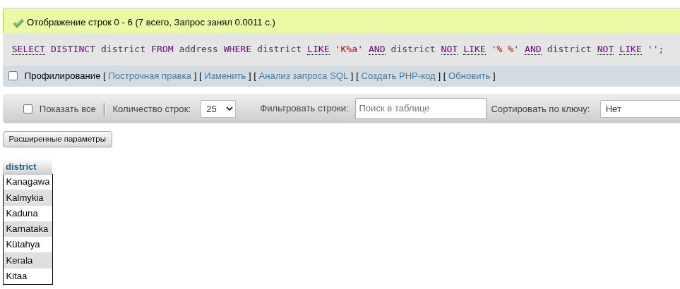
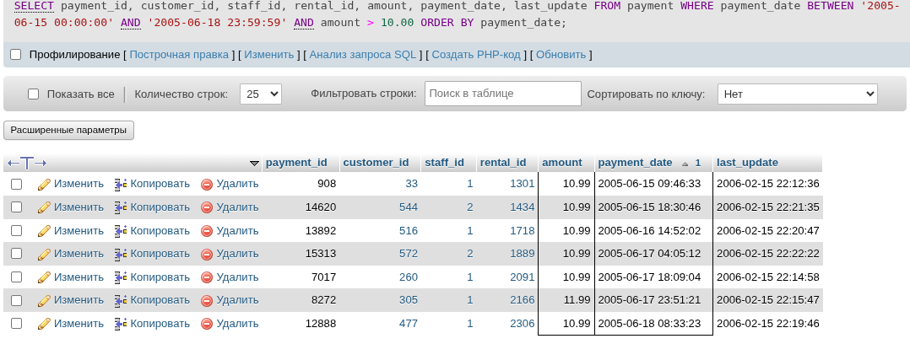
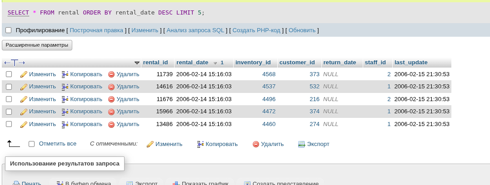
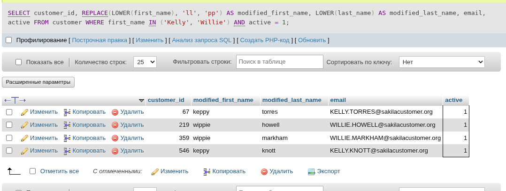

# Домашнее задание к занятию «SQL. Часть 1» - Малявко Сергей (netology)

Задание можно выполнить как в любом IDE, так и в командной строке.

### Задание 1
Получите уникальные названия районов из таблицы с адресами, которые начинаются на “K” и заканчиваются на “a” и не содержат пробелов.

### Выполнение задания 1
```sql
SELECT DISTINCT district
FROM address
WHERE district LIKE 'K%a' 
  AND district NOT LIKE '% %'
  AND district NOT LIKE '';
```
##### Скриншот выполнения команды


### Задание 2
Получите из таблицы платежей за прокат фильмов информацию по платежам, которые выполнялись в промежуток с 15 июня 2005 года по 18 июня 2005 года включительно и стоимость которых превышает 10.00.

### Выполнение задания 2
```sql
SELECT 
    payment_id,
    customer_id,
    staff_id,
    rental_id,
    amount,
    payment_date,
    last_update
FROM 
    payment
WHERE 
    payment_date BETWEEN '2005-06-15 00:00:00' AND '2005-06-18 23:59:59'
    AND amount > 10.00
ORDER BY 
    payment_date;
```
##### Скриншот выполнения команды


### Задание 3
Получите последние пять аренд фильмов.

### Выполнение задания 3
```sql
SELECT *
FROM rental
ORDER BY rental_date DESC
LIMIT 5;
```
##### Скриншот выполнения команды


### Задание 4
Одним запросом получите активных покупателей, имена которых Kelly или Willie.

Сформируйте вывод в результат таким образом:
- все буквы в фамилии и имени из верхнего регистра переведите в нижний регистр,
- замените буквы 'll' в именах на 'pp'.

### Выполнение задания 4
```sql
SELECT 
    customer_id,
    REPLACE(LOWER(first_name), 'll', 'pp') AS modified_first_name,
    LOWER(last_name) AS modified_last_name,
    email,
    active
FROM 
    customer
WHERE 
    first_name IN ('Kelly', 'Willie')
    AND active = 1;
```
##### Скриншот выполнения команды


